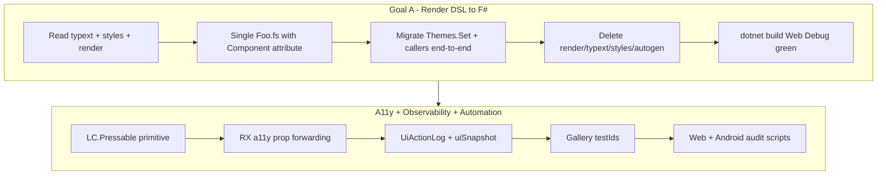

# EggShell Frontend Modernization Plan

Consolidated reference for **render-DSL retirement (Goal A)**, **accessibility + UI observability**, and **automation/OS support**. Synthesized from `EGGSHELL_ARCHITECTURE.md` §12, `CLAUDE.md`, `LEARNINGS.md`, `LibClient/ACCESSIBILITY.md`, and gallery audit work (through 2026-06-27).

---

## 1. North-star goals (current initiative)

**End-state vision (what "done" looks like):** EggShell is **best-in-class for Accessibility and UI
Automation across React Native and Web**, ships **modern features that speed development and improve
customer usability**, and exposes a **single standardized pure-F# component library** with **written,
per-component-type building guidelines** so any contributor (or weaker LLM) can add or convert a
component correctly without re-deriving conventions. Concretely, that means every interactive surface
is a labeled semantic press target, every component carries stable automation `testId`s, the whole
library is one-file `[<Component>]` F# (no render DSL, no `.typext.fs`/`.styles.fs` trio), and §10's
a11y/automation bar is met by every shipped component.

This plan is meant to be **executable by a weaker model**: §9 gives copy-paste skeletons per component
archetype, §10 is the a11y/automation acceptance bar, and §11 is a classify-then-route decision tree.
Read those three before converting anything.

From `EGGSHELL_ARCHITECTURE.md` §12 and `CLAUDE.md`. **Goals F–H are explicitly deferred** (stay on Fable v4, current ReactXP fork).

| Goal | Summary | Status |
|------|---------|--------|
| **A** | Retire render DSL; convert framework `.render` → pure F# `[<Component>]` | **In progress** (~40 `.render` left in LibClient; see §5) |
| **B** | Fix `eggshell create-app` scaffolding (modern app, no `.render`) | Not started (this phase) |
| **C** | Reduce component verbosity (hooks, fewer Estate/Pstate/Actions) | Incremental alongside A |
| **D** | Standardize frontend directory structure | Incremental alongside A |
| **E** | Speed up frontend build | Partial wins; big win when DSL retired |

**Cross-cutting (same phase, not separate goals):**

- **Accessibility (a11y):** semantic press targets, roles/labels/state, live regions, keyboard/focus (later).
- **Observability:** dev-only action log + UI snapshot for debugging and automation.
- **UI automation:** stable `testId`s, gallery audits (web Playwright + Android Appium), testId-first navigation.

These reinforce Goal A: every conversion should land Pressable + labels + testIds, not copy legacy Render.fs soup.

---

## 2. Two parallel workstreams



**Shared root cause:** interactive UI was **visual layer + invisible hit target** (`LC.Pointer.State` + `LC.TapCapture` → unlabeled `RX.Button`). Fix once with `LC.Pressable`, then convert components to pure F# that use it.

---

## 3. Accessibility and observability plan (phases)

### Phase 0 — Source review (done)

- `@chaldal/reactxp` already exposes `CommonAccessibilityProps` (role, state, label, live region, etc.).
- Work is **additive F# forwarding** on `RX.View` / `RX.Button` / `RX.ScrollView`, not a fork patch.
- `accessibilityHint` is **not** in this fork (skip for v1).
- `testId` was missing on some bindings; added where needed.

### Phase 1 — Core infrastructure (done)

| Artifact | Path | Role |
|----------|------|------|
| Accessibility types | `LibClient/src/Accessibility.fs` | Roles, state record, live region enums |
| Prop helpers | `LibClient/src/AccessibilityHelpers.fs` | Apply a11y props to JS objects |
| **Pressable** | `LibClient/src/Components/Pressable.fs` | Labeled semantic button; overlay + semantic modes; drag threshold; dev logging |
| TapCapture shim | `LibClient/src/Components/TapCapture.fs` | Thin wrapper → Pressable (delete when call sites migrated) |
| Live region | `LibClient/src/Components/LiveRegion.fs` | `LC.LiveRegion.announce` |
| **UiActionLog** | `LibClient/src/UiActionLog.fs` | Ring buffer, interactive registry, route tracking |
| RX forwarding | `LibClient/src/ReactXP/Components/View/View.fs`, `Button.fs`, ScrollView | `accessibilityLabel`, `accessibilityRole`, `accessibilityState`, `testId` |
| Route logging | `LibRouter/.../LogRouteTransitions.typext.fs` | `UiActionLog.setCurrentRoute` |
| Docs | `LibClient/ACCESSIBILITY.md` | API + migration checklist |

**Dev hook (DEBUG only):**

```fsharp
LibClient.UiActionLog.installGlobalHook Fable.Core.JS.globalThis "YourAppName"
// window.__eggshell.YourAppName.uiLog()
// window.__eggshell.YourAppName.uiSnapshot()
```

### Phase 2 — Tier-1 press-target migration (done)

Completed items:

- **IconButton:** required `label` at hand-written F# call sites (Quantity, Date, Carousel, ImageViewer, Legacy TopNav IconButton).
- **TextButton:** migrated to `LC.Pressable` with label + role.
- **Button, Nav.Top.Item, Sidebar.Item:** full **`[<Component>]` conversion** (not `.render` patches) with `LC.Pressable`, accessibility labels, component names for logging.
- **ShowSidebarButton:** pure F#; `testId="eggshell-sidebar-menu"`.
- **ToggleButton:** Pressable arg-order fix (FS0691).

**Deferred from Phase 2:** Focus/keyboard v1 (dialog focus trap, drawer trap) — cancelled for v1; Escape on dialogs still works via existing `Dialog.Base`.

### Phase 3 — Gallery testIds + observability hooks (mostly done)

| testId | Element |
|--------|---------|
| `eggshell-sidebar-menu` | Handheld sidebar menu (`Nav.Top.ShowSidebarButton`) |
| `sidebar-blade-components` | Components blade (fixed-top sidebar) |
| `sidebar-component-{CaseName}` | Component nav item |
| `sidebar-scroll-middle` | Middle scroll region in sidebar |
| `aesg-sample-visuals` | Component sample wrapper (`ComponentSample`) |

Gallery sidebar blade testIds live in `SidebarContent.fs` (pure F#). **`Sidebar.render` is still render DSL** — full gallery sidebar page conversion pending.

### Phase 4 — Audit harness (partial)

- **Web:** `AppEggShellGallery/audit-gallery-interactive.mjs`, assertions, visual archive, full crawl — documented in `GALLERY-AUDIT.md`.
- **Android:** Appium/WebdriverIO facade; testId → `resource-id` mapping; menu-tap nav (no edge-swipe); drawer reopen per navigation.
- **Blocked until testIds exist** on all nav paths; Phase 3 unblocked primary flows.
- **Not done:** full audit rewrite to prefer `uiSnapshot()` over heuristics; interactive Android audit with testId nav not fully validated end-to-end.

### Phase 5+ (future)

- Migrate remaining `LC.TapCapture` call sites → `LC.Pressable` (~15+ in LibClient `.render` trees).
- Delete `TapCapture.fs` when zero callers.
- Keyboard/focus: `restrictFocusWithin`, roving tabindex on nav.
- Optional: sampled production telemetry (tiered sinks); v1 is **dev-only** `UiActionLog`.

---

## 4. Render-DSL → F# conversion: best practices

**Authoritative detail:** `LEARNINGS.md` (2026-06-26 recipe, 2026-06-27 anti-patterns). **Rules:** `CLAUDE.md` §7–10.

### 4.1 Target end-state (Goal A)

One file per component:

```fsharp
[<AutoOpen>]
module LibClient.Components.Foo   // or Nav_Top_Item for nested paths

open Fable.React                // MANDATORY for [<Component>]
open LibClient
open ReactXP.Components
open ReactXP.Styles             // NOT ReactXP.LegacyStyles (shadows make*Styles CEs)

module private Styles = ...       // makeViewStyles / makeTextStyles

type LC.Foo.Theme = { ... }     // or nested under module LC

type LibClient.Components.Constructors.LC with
    [<Component>]
    static member Foo(...) : ReactElement = ...
```

**Delete:** `Foo.render`, `Foo.typext.fs`, `Foo.styles.fs`, `_autogenerated_/Components/Foo/*`, `RegisterRender` / `RegisterStyles` entries (regenerated by `eggshell build-lib`).

### 4.2 What NOT to do

| Anti-pattern | Why |
|--------------|-----|
| Copy `_autogenerated_/.../Foo.Render.fs` into `Foo.fs` | Keeps `findApplicableStyles`, `__parentFQN`; not modernization; no Pressable/a11y |
| Keep `.typext.fs` beside new `Foo.fs` | Old trio; public types belong in the same file |
| Patch `.render` for a11y/testIds/behavior | Rule 7: convert to pure F# instead |
| Leave `FooStyles.Theme.Customize` in `DefaultComponentsTheme` while also adding `Themes.Set` | Parallel legacy shims; upgrade **all callers** in the same change |
| `open ReactXP.LegacyStyles` in modern files | Breaks `makeViewStyles` CE (FS0041 yield errors) |
| Declare `State`/`Actionable` at module top with `[<AutoOpen>]` | Leaks union cases globally; collides with `DefaultComponentsTheme` |

### 4.3 Per-component checklist

1. **Preflight:** `grep -rn "FooStyles" --include="*.styles.fs"` repo-wide. If external consumers exist, plan a **cluster** (§4.5) or end-to-end caller migration — not a compat shim left indefinitely.
2. Read trio: `.typext.fs`, `.styles.fs`, `.render`, generated `.Render.fs` (semantic reference only).
3. Pick template: `Tabs.fs`, `Tab.fs`, `HandheldListItem.fs`, `Nav/Top/Heading/Heading.fs`, `Sidebar/Base/Base.fs`, `Button.fs`.
4. Write single `Foo.fs`: port styles to `module private Styles`; translate render tree to `RX.*` / `LC.*`, `elements { }`, `match` for `rt-match`.
5. **Theming:** `Themes.Set<LC.Foo.Theme>({ ... })` in `DefaultComponentsTheme.fs`; component uses `Themes.GetMaybeUpdatedWith theme`.
6. **End-to-end callers:** migrate every `FooStyles.Theme.*` consumer to `?theme` or direct style arrays; then delete `Foo.styles.fs`.
7. **Pressable:** interactive components use `LC.Pressable` (label, role, optional testId, pointerState when using `LC.Pointer.State`).
8. **Signature compat (temporary):** optional `?xLegacyStyles` bridge until all callers converted; remove when grep is clean.
9. Update `.fsproj` compile order; run `eggshell build-lib` + `dotnet build LibClient/src/LibClient.fsproj -c "Web Debug"`.
10. **Gallery:** mirror in `AppEggShellGallery/src/Components/Content/` as pure F# (see `Nav/Top.fs`, `Content_Grid/Grid.fs`).

### 4.4 Nested namespace pattern

For `LC.Nav.Top.Item`, `LC.Sidebar.Item`:

```fsharp
namespace LibClient.Components.Nav.Top
module Item =
    type State = ...
    type Style = ...
    let iconOnly = ...

namespace LibClient.Components
[<AutoOpen>]
module Nav_Top_Item =
    module LC.Nav.Top.Item =
        type Theme = ...
    type Constructors.LC.Nav.Top with
        [<Component>] static member Item(...) = ...
```

Module name uses **underscores** (`Nav_Top_Item`), not dots, to avoid `LC` module clashes (FS0248).

### 4.5 Dependency strategies

Legacy `*Styles.Theme` APIs form a **graph** (~18 producers consumed from other `.styles.fs` files).

| Strategy | When | Rule today |
|----------|------|------------|
| **Clean leaf** | Zero external `FooStyles` consumers | Convert alone (e.g. early `Tabs`) |
| **Cluster (A)** | Parent styles child internals via class cascade | Convert producer + consumers together; producer gets `?topStyles` / `?theme` / section style params |
| **Compat shim (B)** | — | **Rejected** for new work; migrate all callers, delete shim in same PR |

**Validated cluster:** `VerticallyScrollable` + `Sidebar/Base`.

**Deferred clusters:** `LabelledFormField` (AppUserManagement), `Nav.Top.Base` + nav items, `Input.Text` / form fields, `Badge` / `Button` consumers across dialogs.

### 4.6 Archetype recipes (from conversions)

| Archetype | Pattern | Example |
|-----------|---------|---------|
| Responsive | `LC.With.ScreenSize` + branch inside `makeViewStyles` | `Section/Padded` |
| Pseudo-stateful | No hooks; derive from props each render | `HandheldListItem`, many form wrappers |
| Genuinely stateful | `Hooks.useState` / `useEffectDisposable` | `TriStateful/Abstract`, `Grid`/`QueryGrid` |
| Rich control flow | `match` + child arrays `[| ... |]`, not `elements { match }` | `HandheldListItem` |
| Native vs web | `ReactXP.Runtime.isNative()` branches; no `dom.table` on RN | `LibUiAdmin/Grid` |
| FontWeight | Legacy `RulesRestricted.FontWeight` in `.styles.fs` / themes; modern `ReactXP.Styles.RulesRestricted.FontWeight` in `[<Component>]` | BackButton mapper |

### 4.7 Hard cases (bespoke or defer)

- **Draggable:** refs, gestures, animations — hooks rewrite, not mechanical.
- **Input.ChoiceList:** public type path changes break apps — plan app updates with cluster.
- **Dialogs / forms still on `.render`:** convert cluster when touching (e.g. ContextMenu Dialog uses `ButtonThemes` + `?theme` on `LC.Button` while dialog shell remains render DSL).

### 4.8 Build and validate

```bash
# From lib directory (LibClient, LibRouter, …)
DOTNET_ROOT=~/.dotnet ../eggshell build-lib    # render codegen + registration

dotnet build LibClient/src/LibClient.fsproj -c "Web Debug"
dotnet build LibRouter/src/LibRouter.fsproj -c "Web Debug"

# Gallery render file after .render edit
cd AppEggShellGallery && ../eggshell renderdsl src/Components/Content/Button/Button.render

dotnet build AppEggShellGallery/src/App.fsproj -c "Web Debug"
```

**Gotchas:** `ComponentRegistration.fs` is auto-generated; `eggshell build-lib` omits pure-F# components. macOS has no `timeout`. Fable plugin errors when running `dotnet fable` directly on lib are expected; use app pipeline for full JS emit.

---

## 5. Current state (2026-06-27)

### 5.1 LibClient render DSL remaining

**~40** `.render` files under `LibClient/src/Components/`, including:

- **Inputs:** Text, Checkbox, ChoiceList, ChoiceListItem, Picker cluster (Picker, Field, Dialog, Popup, Base), Image, File, NamedFile, ParsedText, WeeklyCalendar
- **Dialogs:** Base, Confirm, Prompt, Shell variants, FullScreen
- **Nav (legacy layout):** Nav.Top.Base, Nav.Bottom.{Base,Item,Button}
- **Chrome:** AppShell/Content, Badge, FloatingActionButton, IconWithBadge, DateSelector, ContextMenu.{Dialog,Popup}, Draggable, Form/Base, LabelledFormField
- **Legacy:** Legacy.Sidebar.*, Legacy.TopNav.Base, Legacy.Input.*

### 5.2 LibClient converted to pure F# `[<Component>]` (representative)

**Layout / chrome:** Tabs, Tab, VerticallyScrollable, Sidebar.{Base, Item, Heading, Divider, WithClose}, Section/Padded, HandheldListItem, Card, FlexFiller, ScrollView, ItemList, …

**Nav (modern):** Nav.Top.{Item, Heading, Filler, Image, ShowSidebarButton}, Nav.Bottom.Filler

**Inputs (modern leaf):** Many `Input/*.fs` helpers (Date, Quantity, Guid, PhoneNumber, Duration, …) — not all composite pickers

**Interactive / state:** TriStateful.{Abstract, Simple}, QuadStateful, Pointer.State, Pressable, TextButton, ToggleButton, **Button**, IconButton

**Infrastructure:** Accessibility.*, UiActionLog, LiveRegion, AsyncData, With.*, …

**LibUiAdmin:** Grid, QueryGrid (native table fix + pure F#)

**LibRouter:** BackButton (uses `?theme` → `LC.Nav.Top.Item`)

### 5.3 End-to-end caller upgrades (latest)

**Button** and **Nav.Top.Item** no longer have parallel legacy modules:

- Deleted `Button.styles.fs`, `Nav/Top/Item/Item.styles.fs`
- Removed duplicate `ButtonStyles` / `ItemStyles` blocks from `DefaultComponentsTheme.fs`
- **Callers migrated:** ContextMenu Dialog (`ButtonThemes`), PickerInternals Dialog (dead styles removed), Nav.Bottom.Button (`BadgeStyles`), LibRouter BackButton, ShowSidebarButton, gallery Button (`SampleThemes`), gallery Nav/Top (`?theme` for icon adjust)

### 5.4 Gallery modernization

| Area | State |
|------|--------|
| Pure F# content pages | Nav/Top.fs, Grid, QueryGrid, Heading, Code, … |
| Still `.render` | Most `Components/Content/*`, Sidebar, TopNav, Route shells |
| Audit tooling | Web + Android scripts; testId-first nav documented |
| Known build issue | `Bootstrap.fs` `globalThis` (pre-existing) |
| Stale autogen | `_autogenerated_/Content/Nav/Top/Top.Render.fs` orphaned after Top.fs conversion |

### 5.5 TapCapture → Pressable

- **Done on:** Button, Nav.Top.Item, Sidebar.Item, TextButton, IconButton (component internals), Pressable/TapCapture shim
- **Real surface (grep `TapCapture` in `LibClient/src`, 2026-06-28): 46 references.** `LC.Pressable` has only **11** callers, so adoption is still early.
  - **~14 `.render` / autogenerated** trees: FloatingActionButton, WeeklyCalendar, ChoiceListItem, Checkbox, PickerInternals.{Dialog,Field}, Legacy.Input.Picker, Input.Text, ContextMenu.Popup, Nav.Bottom.Item, plus already-converted Button/Sidebar.Item/Nav.Top.Item autogen left on disk.
  - **~16 pure-F# components still calling `LC.TapCapture` directly:** `Tag`, `TouchableOpacity`, `AppleAppStoreButton`, `GooglePlayStoreButton`, `TextButton`, `ThumbCard`, `Thumb`, `ItemList`, `HeaderCell`, `PaginatedVirtualListView`, `PaginatedScrollView`, `Scrim`, `IconButton`, `Input/DayOfTheWeek`, `Legacy/Card`, `Dialogs.fs`. (TapCapture is now a Pressable shim, so these are *semantically* a11y-safe but should still gain explicit `label`/`role`/`testId` via direct `LC.Pressable` calls.)
- **Definition of "swept":** zero `TapCapture` matches outside `TapCapture.fs` / `TapCaptureDebugVisibility.fs` / the two `RulesBasic.fs` style files; then delete the shim.

### 5.6 Phase summary table

| Phase | Description | Status |
|-------|-------------|--------|
| 0 | ReactXP a11y source review | Done |
| 1 | Pressable, UiActionLog, RX bindings, core types | Done |
| 2 | Tier-1 labels + Button/Nav.Top.Item/Sidebar.Item Pressable + F# conversion | Done |
| 3 | Gallery testIds + route/action logging | Mostly done |
| 4 | Audit harness testId-first | Partial (scripts exist; full validation pending) |
| — | End-to-end caller upgrade (no legacy shims) | Done for Button + Nav.Top.Item |
| — | Goal A bulk `.render` retirement | ~50% LibClient by file count; dependency clusters remain |

---

## 6. Recommended sequencing (next work)

1. **Cluster converts** (high fan-out): `Badge`, `Nav.Top.Base` + remaining top nav, `Input.Text` + LabelledFormField, `FloatingActionButton`.
2. **Gallery mirrors:** convert Content pages when touching LibClient twins; remove orphaned `_autogenerated_` pages.
3. **TapCapture sweep:** each `.render` conversion should finish with Pressable; grep `LC.TapCapture` until zero, delete shim.
4. **Automation:** run interactive Android audit with testId nav; extend assertions to use `uiSnapshot()` where possible.
5. **Do not start:** Fable 5, .NET 10, ReactXP swap, Orleans/Postgres (Goals F–H).

---

## 7. Key reference files

| Topic | Location |
|-------|----------|
| Architecture roadmap | `EGGSHELL_ARCHITECTURE.md` §12 |
| Agent/project rules | `CLAUDE.md` |
| Conversion gotchas + dated log | `LEARNINGS.md` |
| A11y API + checklist | `LibClient/ACCESSIBILITY.md` |
| Gallery audit how-to | `AppEggShellGallery/GALLERY-AUDIT.md` |
| Default theming | `LibClient/src/DefaultComponentsTheme.fs` |
| Templates | `LibClient/src/Components/Tabs/Tabs.fs`, `HandheldListItem/HandheldListItem.fs`, `Nav/Top/Heading/Heading.fs`, `Button/Button.fs`, `Nav/Top/Item/Item.fs` |

---

## 8. Definition of done (single component)

- [ ] Single `Foo.fs` with `[<Component>]`, no `.render` / `.typext.fs` / `.styles.fs`
- [ ] `Themes.Set<LC.Foo.Theme>` in `DefaultComponentsTheme.fs`; no parallel `FooStyles.Theme.Customize`
- [ ] All repo callers migrated (framework, LibRouter, gallery)
- [ ] Interactive surfaces use `LC.Pressable` with `label` (+ `testId` if automation-relevant)
- [ ] Gallery content page pure F# if component is showcased
- [ ] `dotnet build` Web Debug green for affected projects
- [ ] `LEARNINGS.md` entry if a new gotcha was discovered
- [ ] §10 a11y/automation bar met for the component's type

---

## 9. Component archetype playbook (copy-paste skeletons)

This is the **standardized building guideline per component type** (Goal C/D + the end-state vision).
Classify the component with §11, then start from the matching skeleton. All skeletons assume the modern
single-file form. Real references in-repo are named under each.

**Shared header (every modern component file):**

```fsharp
[<AutoOpen>]
module LibClient.Components.Foo          // dotted module ONLY at top level; nested paths use §4.4

open Fable.React                          // MANDATORY: [<Component>] resolves Fable.React.ComponentAttribute
open LibClient
open LibClient.Accessibility              // AccessibilityRole, AccessibilityStateRecord
open ReactXP.Components                   // RX.*, LC.*
open ReactXP.Styles                       // make*Styles CEs. NEVER open ReactXP.LegacyStyles here.
```

### 9.1 Leaf display (non-interactive: text, icon, badge, card)

No state, no press target. Pure props -> elements.

```fsharp
[<RequireQualifiedAccess>]
module private Styles =
    let view = makeViewStyles { padding 8 }
    let text = makeTextStyles { fontSize 14; color Color.Black }

type LibClient.Components.Constructors.LC with
    [<Component>]
    static member Foo(text: string, ?styles: array<ViewStyles>, ?key: string) : ReactElement =
        key |> ignore
        RX.View(
            styles = [| Styles.view; yield! styles |> Option.defaultValue [||] |],
            children = elements { LC.UiText(text, styles = [| Styles.text |]) }
        )
```

**a11y bar:** if it conveys status, set `importantForAccessibility`/`liveRegion`; otherwise none required.
**Refs:** `Heading.fs`, `Card.fs`, `Tag.fs`.

### 9.2 Interactive control (button, toggle, nav item, list row)

**MUST** route every tap through `LC.Pressable` (never a bare `RX.View onPress` or invisible overlay).
Use `overlay = true` only when visual content and hit area must be layered (the old TapCapture pattern).

```fsharp
module LC =
    module Foo =
        type State =
        | Disabled
        | Actionable of OnPress: (ReactEvent.Action -> unit)
        type Theme = { Color: Color }
open LC.Foo

type LibClient.Components.Constructors.LC with
    [<Component>]
    static member Foo(label: string, state: State, ?testId: string, ?theme: Theme -> Theme, ?key: string) =
        key |> ignore
        let theTheme = Themes.GetMaybeUpdatedWith theme
        RX.View(
            styles = [| Styles.view theTheme |],
            children =
                elements {
                    LC.UiText(label, styles = [| Styles.text theTheme |])
                    match state with
                    | Actionable onPress ->
                        LC.Pressable(
                            onPress = onPress,
                            label = label,                    // REQUIRED
                            role = AccessibilityRole.Button,  // Tab / Link / Switch / MenuItem as fits
                            ?testId = testId,                 // when automation-relevant
                            state = { AccessibilityStateRecord.empty with Disabled = Some false },
                            overlay = true,
                            componentName = "LC.Foo")         // for UiActionLog
                    | Disabled -> noElement
                }
        )
```

**a11y bar:** §10 row "Interactive" is mandatory (label + role + state + testId).
**Refs:** `Tab.fs`, `Button/Button.fs`, `Nav/Top/Item/Item.fs`, `Sidebar/Item/Item.fs`, `TextButton.fs`.
**Hover/depress visuals:** pass `pointerState = ...` from `LC.Pointer.State` (see `Pressable.fs` signature).

### 9.3 Layout / container (scrollable, sidebar, section, filler)

Often a **cluster producer** (§4.5): parent styles child internals. Expose per-section style params
instead of the legacy class cascade; keep existing public ctor arg names so app callers stay green.

```fsharp
static member Foo(
        fixedTop: ReactElement, scrollableMiddle: ReactElement,
        ?topStyles: array<ViewStyles>, ?middleStyles: array<ViewStyles>, ?key: string) =
    RX.View(
        children = elements {
            RX.View(styles = [| Styles.top; yield! defaultArg topStyles [||] |], children = element { fixedTop })
            RX.ScrollView(styles = [| Styles.middle; yield! defaultArg middleStyles [||] |], children = element { scrollableMiddle })
        })
```

**Refs:** `VerticallyScrollable.fs` + `Sidebar/Base/Base.fs` (validated cluster), `Section/Padded/Padded.fs`.

### 9.4 Responsive

Branch **inside** the style CE on `LC.With.ScreenSize`; do not fork the whole tree.

```fsharp
open LibClient.Responsive
// ...
LC.With.ScreenSize (fun screenSize ->
    let view = makeViewStyles { match screenSize with
                               | ScreenSize.Desktop  -> padding 24
                               | ScreenSize.Handheld -> padding 16 }
    RX.View(styles = [| view |], children = ...))
```

**Refs:** `Section/Padded/Padded.fs`.

### 9.5 Pseudo-stateful (estate is empty or derived from props)

**No hooks.** Compute the value as a local `let` in the render body. Most form wrappers and list items
are this, not genuinely stateful.

**Refs:** `HandheldListItem/HandheldListItem.fs`, many `Input/*` leaves.

### 9.6 Genuinely stateful (toggles, async, timers, subscriptions)

Use Fable hooks. `Hooks.useState` for local state, `Hooks.useEffectDisposable` for subscriptions/timers,
`Hooks.useRef` for imperative handles. `open Fable.React`; `startSafely` from `open LibClient`.

```fsharp
let hook = Hooks.useState initial          // read hook.current, write hook.update v
let onAct () =
    hook.update InProgress
    async { let! r = action in hook.update (Done r) } |> startSafely
// sync from a prop when it changes:
Hooks.useEffect ((fun () -> hook.update fromProps), [| fromProps |])
```

**Refs:** `TriStateful/Abstract`, `QuadStateful.fs`, `LibUiAdmin` `Grid`/`QueryGrid`.

### 9.7 Input / form leaf

Same as 9.2/9.5 but the press target is the field; keep the public type path stable (apps import it).
ChoiceList-class components change public paths and **must** be done as a cluster with app updates (§4.7).
**a11y bar:** label associated with the control, `state` reflects `disabled`/`checked`/`selected`.
**Refs:** modern `Input/*.fs` leaves; deferred composites listed in §4.7.

### 9.8 Dialog / overlay

Convert the shell as a cluster when touched. Dialogs keep Escape-to-close via `Dialog.Base`. Use
`role = AccessibilityRole.Dialog`, `liveRegion`/focus per §10 (focus trap is deferred for v1).
**Refs:** ContextMenu Dialog uses `?theme` on `LC.Button` while shell migration is pending.

### 9.9 Native-divergent (tables, platform widgets)

No HTML tags on React Native. Branch with `ReactXP.Runtime.isNative()` (runtime) or
`#if EGGSHELL_PLATFORM_IS_WEB` (compile-time): `dom.table`/`dom.td` on web, `RX.View` flex rows on native.
**Refs:** `LibUiAdmin/Grid` + `GridCell`, gallery `Snippets`.

### 9.10 ThirdParty JS/RN wrapper

Keep the established recipe: `TypesJs.fs` (marshal F# -> JS with `==>`/`==?>`/`==!>`) + the component
(`Web/`, `Native/`, `With/` split as needed). Pin RN-version-sensitive native libs (see LEARNINGS).

---

## 10. Best-in-class accessibility + automation bar (acceptance)

A component is **not done** until its archetype row is satisfied. This is the measurable definition of
"best-in-class a11y + UI automation."

| Archetype | Label | Role | State | testId | Live region | Keyboard/focus (v2) |
|-----------|-------|------|-------|--------|-------------|---------------------|
| Leaf display | only if status-bearing | - | - | optional | if it announces | - |
| Interactive control | **required** | **required** | disabled/selected as applicable | **required** | - | focusable, Enter/Space |
| Input/form leaf | **required** (associated) | field role | disabled/checked/selected | **required** | error -> assertive | tab order |
| Layout/container | - | - | - | optional (scroll regions) | - | scroll containment |
| Dialog/overlay | title -> label | `Dialog` | - | **required** | open -> polite | Escape (have); trap (v2) |

**Cross-cutting requirements (all interactive components):**

- Single labeled press target via `LC.Pressable` (no visual-plus-invisible-overlay split).
- Stable `testId` survives refactors; slugged ids via `A11ySlug.testId prefix label`.
- Press/nav actions recorded to `UiActionLog`; component registers in the interactive registry
  (Pressable does this automatically via `componentName`).
- `window.__eggshell.<App>.uiSnapshot()` lists the component (testId/label/role/state) when mounted.
- Web automation: reachable in the Playwright crawl (`audit-gallery-interactive.mjs`).
- Android automation: `testId` maps to `resource-id`; nav reaches it via testId-first selectors.

**Best-in-class extras (modern features, post-bar):** focus management (`restrictFocusWithin`, roving
tabindex), keyboard shortcuts, a real animation story (spring/gesture/route transitions, currently thin
per architecture §6.6), and `uiSnapshot()`-driven assertions replacing heuristics in the audit harness.

---

## 11. Weak-LLM execution guide (classify, then route)

**Step 0 - Preflight (always):**

```bash
grep -rn "FooStyles" --include="*.styles.fs" .            # external style consumers? -> cluster (§4.5)
grep -rnE "Foo\.Make|LC\.Foo\b" --include="*.fs" --include="*.render" .   # callers that may break
```

If `FooStyles` has consumers outside `Foo/`, or `Foo.Make` is called by an app, **do not convert
solo** - plan a cluster / caller migration (§4.5, §4.7). Otherwise proceed.

**Step 1 - Classify** (decide the archetype):

1. Does it handle a tap / press / nav? -> **Interactive (9.2)** or **Input (9.7)**.
2. Else does it only arrange children? -> **Layout/container (9.3)**.
3. Else does it hold real internal state (toggle/async/timer/subscription)? -> **Stateful (9.6)**.
4. Else is its estate empty or pure-derived-from-props? -> **Pseudo-stateful (9.5)**.
5. Else -> **Leaf display (9.1)**.
   Modifiers that stack on any of the above: **Responsive (9.4)**, **Native-divergent (9.9)**,
   **Dialog (9.8)**, **ThirdParty (9.10)**.

**Step 2 - Build** from the §9 skeleton; port `.styles.fs` to `module private Styles`
(`makeViewStyles`/`makeTextStyles`/`*.Memoize`); follow the §4.3 per-component checklist.

**Step 3 - a11y/automation:** satisfy the §10 row for the archetype.

**Step 4 - Delete + register:** remove `.render`, `.typext.fs`, `.styles.fs`, the whole
`_autogenerated_/Components/Foo/` dir, and the `RegisterRender`/`RegisterStyles` lines; fix `.fsproj`
compile order; run `eggshell build-lib` (regenerates `ComponentRegistration.fs`).

**Step 5 - Validate (never skip):**

```bash
dotnet build LibClient/src/LibClient.fsproj -c "Web Debug"     # must be 0 errors
# orphan check: a converted comp must have Foo.fs and NO Foo.typext.fs / Foo.render
find LibClient/src/Components -name '*.render' | while read r; do d=$(dirname "$r"); b=$(basename "$r" .render); \
  [ -f "$d/$b.fs" ] && [ ! -f "$d/$b.typext.fs" ] && echo "ORPHAN: $r"; done
```

For app-facing or `.render`-referenced components, also run a full `eggshell dev-web` of the gallery
(LibClient build alone does not catch app/DSL caller breakage - see LEARNINGS 2026-06-27).

**Step 6 - Mirror + log:** update the gallery page to pure F# (Rule 10); append a `LEARNINGS.md` entry
if a new gotcha appeared.

**Hard "do not" list (from LEARNINGS anti-patterns):** never copy `_autogenerated_/.../Foo.Render.fs`
into `Foo.fs`; never `open ReactXP.LegacyStyles` in a modern file; never declare public `State`/union
types at module top with `[<AutoOpen>]` (nest under `module LC = module Foo`); never leave a
`FooStyles.Theme.Customize` shim alongside a new `Themes.Set`; never use top-level dotted
`module A.B.C =` for an auxiliary module (use `namespace A.B` + `module C =`).
