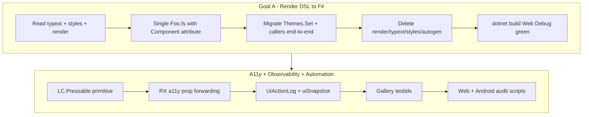

# EggShell Frontend Modernization Plan

Consolidated reference for **render-DSL retirement (Goal A)**, **accessibility + UI observability**, and **automation/OS support**. Synthesized from `EGGSHELL_ARCHITECTURE.md` §12, `CLAUDE.md`, `LEARNINGS.md`, `LibClient/ACCESSIBILITY.md`, and gallery audit work (through 2026-06-29; audit harness + gallery routes updated same day).

---

## 1. North-star goals (current initiative)

**End-state vision (what "done" looks like):** EggShell is **best-in-class for Accessibility and UI
Automation across React Native and Web**, ships **modern features that speed development and improve
customer usability**, and exposes a **single standardized pure-F# component library** with **written,
per-component-type building guidelines** so any contributor (or weaker LLM) can add or convert a
component correctly without re-deriving conventions. Concretely, that means every interactive surface
is a labeled semantic press target, every component carries stable automation `testId`s, the whole
library is one-file `[<Component>]` F# (no render DSL, no `.typext.fs`/`.styles.fs` trio), and §10's
a11y/automation bar is met by every shipped component.

**As of 2026-06-29:** infrastructure and Tier-1 nav/buttons meet much of this vision; **§10 is not yet
 satisfied by every LibClient component** (~16 still on `TapCapture` shim without explicit
 label/role/testId; audits still pseudo-element-heavy). See §3 Phase 4–5, §5.7, §10.

This plan is meant to be **executable by a weaker model**: §9 gives copy-paste skeletons per component
archetype, §10 is the a11y/automation acceptance bar, and §11 is a classify-then-route decision tree.
Read those three before converting anything.

From `EGGSHELL_ARCHITECTURE.md` §12 and `CLAUDE.md`. **Goals F–H are explicitly deferred** (stay on Fable v4, current ReactXP fork).

| Goal | Summary | Status |
|------|---------|--------|
| **A** | Retire render DSL; convert framework `.render` → pure F# `[<Component>]` | **Done (product code)** — **0** framework/app `.render` files; compiler test fixtures only in `Meta/AppRenderDslCompiler`; see §5 |
| **B** | Fix `eggshell create-app` scaffolding (modern app, no `.render`) | Not started (this phase) |
| **C** | Reduce component verbosity (hooks, fewer Estate/Pstate/Actions) | Incremental alongside A |
| **D** | Standardize frontend directory structure | Incremental alongside A |
| **E** | Speed up frontend build | Partial wins; big win when DSL retired |

**Cross-cutting (same phase, not separate goals):**

- **Accessibility (a11y):** semantic press targets, roles/labels/state, live regions, keyboard/focus (later).
- **Observability:** dev-only action log + UI snapshot for debugging and automation.
- **UI automation:** stable `testId`s, gallery audits (web Playwright + Android Appium), testId-first navigation.

These reinforce Goal A: every conversion should land Pressable + labels + testIds, not copy legacy Render.fs soup.

---

## 2. Two parallel workstreams



**Shared root cause:** interactive UI was **visual layer + invisible hit target** (`LC.Pointer.State` + `LC.TapCapture` → unlabeled `RX.Button`). Fix once with `LC.Pressable`, then convert components to pure F# that use it.

---

## 3. Accessibility and observability plan (phases)

### Phase 0 — Source review (done)

- `@chaldal/reactxp` already exposes `CommonAccessibilityProps` (role, state, label, live region, etc.).
- Work is **additive F# forwarding** on `RX.View` / `RX.Button` / `RX.ScrollView`, not a fork patch.
- `accessibilityHint` is **not** in this fork (skip for v1).
- `testId` was missing on some bindings; added where needed.

### Phase 1 — Core infrastructure (done)

| Artifact | Path | Role |
|----------|------|------|
| Accessibility types | `LibClient/src/Accessibility.fs` | Roles, state record, live region enums |
| Prop helpers | `LibClient/src/AccessibilityHelpers.fs` | Apply a11y props to JS objects |
| **Pressable** | `LibClient/src/Components/Pressable.fs` | Labeled semantic button; overlay + semantic modes; drag threshold; dev logging |
| TapCapture shim | `LibClient/src/Components/TapCapture.fs` | Thin wrapper → Pressable (delete when call sites migrated) |
| Live region | `LibClient/src/Components/LiveRegion.fs` | `LC.LiveRegion.announce` |
| **UiActionLog** | `LibClient/src/UiActionLog.fs` | Ring buffer, interactive registry, route tracking |
| RX forwarding | `LibClient/src/ReactXP/Components/View/View.fs`, `Button.fs`, ScrollView | `accessibilityLabel`, `accessibilityRole`, `accessibilityState`, `testId` |
| Route logging | `LibRouter/.../LogRouteTransitions.fs` | `UiActionLog.setCurrentRoute` |
| Docs | `LibClient/ACCESSIBILITY.md` | API + migration checklist |

**Dev hook (DEBUG only):**

```fsharp
LibClient.UiActionLog.installGlobalHook Fable.Core.JS.globalThis "YourAppName"
// window.__eggshell.YourAppName.uiLog()
// window.__eggshell.YourAppName.uiSnapshot()
```

### Phase 2 — Tier-1 press-target migration (done)

Completed items:

- **IconButton:** required `label` at hand-written F# call sites (Quantity, Date, Carousel, ImageViewer, Legacy TopNav IconButton).
- **TextButton:** migrated to `LC.Pressable` with label + role.
- **Button, Nav.Top.Item, Sidebar.Item:** full **`[<Component>]` conversion** (not `.render` patches) with `LC.Pressable`, accessibility labels, component names for logging.
- **ShowSidebarButton:** pure F#; `testId="eggshell-sidebar-menu"`.
- **ToggleButton:** Pressable arg-order fix (FS0691).

**Deferred from Phase 2:** Focus/keyboard v1 (dialog focus trap, drawer trap) — cancelled for v1; Escape on dialogs still works via existing `Dialog.Base`.

### Phase 3 — Gallery testIds + observability hooks (mostly done)

| testId | Element |
|--------|---------|
| `eggshell-sidebar-menu` | Handheld sidebar menu (`Nav.Top.ShowSidebarButton`) |
| `sidebar-blade-components` | Components blade (fixed-top sidebar) |
| `sidebar-component-{CaseName}` | Component nav item |
| `sidebar-scroll-middle` | Middle scroll region in sidebar |
| `aesg-sample-visuals` | Component sample wrapper (`ComponentSample`) |

Gallery sidebar blade testIds live in `SidebarContent.fs` (pure F#). Gallery **Content/Sidebar** showcase page is also converted (`Content/Sidebar/Sidebar.fs`).

**Sidebar observability gap:** explicit close via `LC.Sidebar.WithClose` / `setSidebarVisibility false` logs `UiActionLog.SidebarClose` and broadcasts on the EventBus. **Popup `OnDismiss` auto-close** (off-click on handheld drawer) only updates internal state — **no `SidebarClose` in `uiLog()`**. Not a DOM event; automation reads dev hook `window.__eggshell.<App>.uiLog()` (DEBUG only).

### Phase 4 — Audit harness (in progress)

| Script | Role |
|--------|------|
| `audit-gallery-interactive.mjs` | Headed/headless full crawl; route discovery from `Components.fs`; assertions; visual archive |
| `audit-gallery-full.mjs` | Fast console-only sweep (**uses `discoverGalleryComponents()`** since 2026-06-29) |
| `audit-gallery-browser-session.mjs` | Detect closed/crashed Playwright context; wait for dev-web; recover + retry once |
| `audit-gallery-app-crash.mjs` | Detect webpack / top-level error overlay; block route; escape to safe page; `blocked-components.json` |
| `audit-gallery-visual-archive.mjs` | Before + after screenshots; **mid-animation** frames on Animatable* pages |
| `audit-gallery-interactive-android.mjs` | Appium path (not validated end-to-end here) |

**Interactive audit features (2026-06-29):**

- Per-page console cap (1000); `Input_File` interaction limited to first sample cell
- Checkpoint after each route + `--resume=DIR` for interrupted runs
- App-crash overlay → log + screenshot + skip route for remainder of run; continue on safe fallback (`Index`, …)
- Visual archive: `sample-NN-before-interaction.png`, `sample-NN-after-interaction.png`, `sample-NN-mid-0N-animation.png` (Animatable*)

**Still not done:**

- Full audit rewrite to prefer `uiSnapshot()` / `testId` selectors over `[data-text-as-pseudo-element]` heuristics
- Interactive Android audit with testId nav validated end-to-end
- Clean full-crawl green run after Input_File fix (re-run pending stable dev-web)

### Phase 5+ (future)

- Migrate remaining `LC.TapCapture` call sites → `LC.Pressable` (~8–16 in LibClient pure F#; see §5.7).
- Delete `TapCapture.fs` when zero callers.
- Route **all** sidebar hide paths through `setSidebarVisibility false` (including popup `OnDismiss`) so `SidebarClose` appears in `UiActionLog`.
- Keyboard/focus: `restrictFocusWithin`, roving tabindex on nav.
- Optional: sampled production telemetry (tiered sinks); v1 is **dev-only** `UiActionLog`.

---

## 4. The component standard (quality bar)

The skeleton is §9, the step-by-step is §11, "done" is §8. **This section is the bar all three must
meet.** Authoritative detail: `LEARNINGS.md`. Rules: `CLAUDE.md` §7–10.

### 4.1 Optimal standard (do not regress)

The final standard is the *fixed* state the codebase converged to, **not** the human baseline. Humans
were not perfect: history eliminated style leaks and console-warning spam, and conversions must not
reintroduce them. Every new or converted component MUST satisfy both lists.

**No style leaks**

- **No cross-component class cascade.** Legacy let a parent style a child's named internal classes
  (`"view" ==> ChildStyles.Theme.One`). Forbidden. A parent passes styles to a child via per-section
  style props (`?topStyles`/`?middleStyles`) or `?theme` (§4.4), never by styling the child's classes.
- **No `findApplicableStyles` / `__componentStyles` / `class='{TopLevelBlockClass}'` soup** — that is
  the autogenerated `Render.fs` you must never copy into a hand-written file.
- **No implicit global CSS** (`FixmeCrappyStyleSharing`). A component that needs a shared sheet (e.g.
  `la-table`) `open`s/imports it explicitly in its `.fs` (see `LibUiAdmin` Grid), not via a hidden cascade.
- **`xLegacyStyles` is a temporary bridge only.** Keep it while not-yet-converted `.render` callers
  still pass it; delete it once `grep` is clean. It must not survive into the final state.
- **Memoize with a stable key on hot/native paths.** `ViewStyles.Memoize` keys by tuple (fast-memoize)
  and can re-allocate on native re-render; for cells/rows key by a stable string via a module-level
  `Dictionary<string, _>` (see `GridCell`).

**Zero new console warnings**

- Do **not** pass legacy styles to `LC.Icon` (emits "legacy-styles" warnings); pass
  `styles = [| makeTextStyles { ... } |]`.
- No React `defaultProps` (deprecated in React 18); use F# optional args + `defaultArg`.
- Provide `key`s for list children; never pass a React element where a string is expected
  (`LC.UiText`, Code/SyntaxHighlighter crash with "Objects are not valid as a React child").
- Do not grow ReactXP `childContextTypes`/`contextTypes` usage (that warning class is the fork itself,
  deferred to Goal H).
- An `AsyncData` rendered `Failed` at mount throws unless a `WhenFailed` branch is supplied.

### 4.2 Anti-patterns

| Anti-pattern | Why |
|--------------|-----|
| Copy `_autogenerated_/.../Foo.Render.fs` into `Foo.fs` | Keeps `findApplicableStyles`/`__parentFQN` soup; not modernization; no Pressable/a11y |
| Keep `.typext.fs` beside new `Foo.fs` | Old trio; public types belong in the same file |
| Patch `.render` for a11y/testIds/behavior | Rule 7: convert to pure F# instead |
| Parent styles a child's internal classes (class cascade) | Style leak (§4.1); pass `?theme`/section style props instead |
| Leave `FooStyles.Theme.Customize` in `DefaultComponentsTheme` while also adding `Themes.Set` | Parallel legacy shims; upgrade **all callers** in the same change |
| Pass legacy styles to `LC.Icon` / use `defaultProps` | Console-warning regression (§4.1) |
| `open ReactXP.LegacyStyles` in modern files | Breaks `makeViewStyles` CE (FS0041 yield errors) |
| Declare `State`/`Actionable` at module top with `[<AutoOpen>]` | Leaks union cases globally; collides with `DefaultComponentsTheme` |

### 4.3 Nested namespace pattern

For `LC.Nav.Top.Item`, `LC.Sidebar.Item`:

```fsharp
namespace LibClient.Components.Nav.Top
module Item =
    type State = ...
    type Style = ...

namespace LibClient.Components
[<AutoOpen>]
module Nav_Top_Item =
    module LC.Nav.Top.Item =
        type Theme = ...
    type Constructors.LC.Nav.Top with
        [<Component>] static member Item(...) = ...
```

Module name uses **underscores** (`Nav_Top_Item`), not dots, to avoid `LC` module clashes (FS0248).

### 4.4 Dependency clusters

Legacy `*Styles.Theme` APIs form a **graph** (~18 producers consumed from other `.styles.fs` files), so
conversion is not always per-component.

| Strategy | When | Rule today |
|----------|------|------------|
| **Clean leaf** | Zero external `FooStyles` consumers | Convert alone (e.g. `Tabs`) |
| **Cluster** | Parent styles child internals via class cascade | Convert producer + consumers together; producer exposes `?topStyles`/`?theme`/section style params; **keep existing public ctor arg names** so app callers stay green |
| **Compat shim** | — | **Rejected** for new work; migrate all callers, delete shim in the same change |

**Validated cluster:** `VerticallyScrollable` + `Sidebar/Base`.
**Deferred clusters:** `LabelledFormField` (AppUserManagement), `Nav.Top.Base` + nav items, `Input.Text`/form fields, `Badge`/`Button` consumers across dialogs.

### 4.5 Hard cases (bespoke or defer)

- **Draggable:** refs, gestures, animations — hooks rewrite, not mechanical.
- **Input.ChoiceList:** public type path changes break apps — plan app updates with the cluster.
- **Dialogs/forms still on `.render`:** convert as a cluster when touched (e.g. ContextMenu Dialog uses `?theme` on `LC.Button` while the shell stays render DSL).

### 4.6 Build and validate

```bash
# From a lib dir (LibClient, LibRouter, …): render codegen + registration regen
DOTNET_ROOT=~/.dotnet ../eggshell build-lib

# Type-check the framework (custom config, NOT plain Debug)
dotnet build LibClient/src/LibClient.fsproj -c "Web Debug"
dotnet build LibRouter/src/LibRouter.fsproj  -c "Web Debug"

# App-facing / .render-referenced components: full app build catches caller breakage the lib build misses
dotnet build AppEggShellGallery/src/App.fsproj -c "Web Debug"   # or a full `eggshell dev-web`
```

**Gotchas:** `ComponentRegistration.fs` is auto-generated (`eggshell build-lib` omits pure-F# components and drops `RegisterRender`/`RegisterStyles` for deleted `.render`). macOS has no `timeout`. `dotnet fable` directly on a lib errors on `FablePlugins` (expected); use the app pipeline for full JS emit.

---

## 5. Current state (2026-06-29)

### 5.0 Goal A — render DSL retirement (**done for product code**)

All **40** framework-owned `.render` components converted to pure F# `[<Component>]` (2026-06-28/29):

| Library | Converted | Notes |
|---------|----------:|-------|
| **LibClient** | 9 | Picker cluster, Input.Text, Dialog.Base, ContextMenu.Dialog; **Legacy.Input.Picker deleted** |
| **LibRouter** | 5 | Dialogs, LogRouteTransitions, NativeBackButton, With.{Location,Route} |
| **LibAutoUi** | 5 | InputForm*, DialogInputForm; modern `LC.Input.Picker` |
| **LibUiSubject** | 4 | Hook-based `UiSubject.With.*` |
| **LibUiSubjectAdmin** | 2 | Subject, Audit.Generic |
| **LibLifeCycleUi** | 1 | IndexQuery placeholder |
| **ThirdParty** | 14 | Map, ReCaptcha, ImagePicker, Showdown MarkdownViewer, GA/FB ViewContent |

**Remaining `.render` files:** **41** — all under `Meta/AppRenderDslCompiler/compiler.Tests/tests/` (compiler fixtures). **Zero** under `Lib*`, `ThirdParty/`, or `AppEggShellGallery/`.

**Build status (Web Debug, 2026-06-29):** LibClient, LibRouter, LibUiSubject, LibUiSubjectAdmin, LibLifeCycleUi, LibAutoUi, all converted ThirdParty packages, AppEggShellGallery — **green**.

**Still to do for Goal A closure:** delete DSL machinery (`Meta/AppRenderDslCompiler`, render steps in build, `eggshell renderdsl` / `convert-component` write path) — deferred until audit pass confirms no regressions.

### 5.0b Framework vs gallery (do not conflate)

Two different trees share names like `Button`:

| What you open | Path | Status |
|---------------|------|--------|
| **Framework component** (what apps import as `LC.Button`) | `LibClient/src/Components/Button/Button.fs` | Pure F# `[<Component>]`, Pressable, themes |
| **Gallery showcase page** (docs/samples) | `AppEggShellGallery/src/Components/Content/Button/Button.fs` | Pure F# page, F# code samples |

Gallery app: **zero** `.render` files; `ComponentRegistration.fs` has **zero** `RegisterRender` entries.

### 5.1 LibAutoUi (**partial — not the old “1–2 week” milestone**)

| Item | Status |
|------|--------|
| Render DSL retired | **Done** — 5 pure-F# `UIAuto.*` components |
| Builds | **Green** |
| Gallery reference | **Partial** — `AutoUi_InputForm` route (string + DateTimeOffset demo) |
| Production app adoption | **None** — Suite apps still use `LC.Form.Base` + typed inputs |
| Primitive UI wiring | **Partial** — only `StringInput` + `DateTimeInput` in `defaultPrimitiveInputComponents`; bool/numeric/file still show “No input component found…” |

Roadmap “finish LibAutoUi (~1–2 weeks)” = **product completion + app adoption**, not render-DSL conversion. Estimate **~3–5 days** to wire remaining primitives + richer gallery samples + one real app screen.

### 5.2 Gallery coverage vs framework components

**Routed component demos** (`Components.fs`): **82** routes (discovered by `audit-gallery-components.mjs`; includes Index markdown, layout/executor XmlDocs pages, LibRouter cluster, ThirdParty additions).

**Content showcase pages** (`Components/Content/**/*.fs`): **~78** pure-F# pages; all use `[<Component>]`.

**ScrapedData.fs** prop tables: **~179** FQN keys (includes infra, dialog shells, picker internals, LibRouter, LibAutoUi — not all need a sidebar demo).

**Coverage gaps (intentional or pending):**

| Component | In ScrapedData | Gallery route | Notes |
|-----------|:--------------:|:-------------:|-------|
| `Dialog.Base`, `ContextMenu.Dialog` | yes | indirect | Exercised via Dialogs / ContextMenu pages |
| Picker internals | partial | indirect | Via Input_Picker page |
| `ThirdParty.MarkdownViewer` | yes | **done** | `ThirdParty_MarkdownViewer` — wired 2026-06-29 |
| `ThirdParty.ImagePicker`, `ReCaptcha` | yes | **done** | Showcase pages + `ImagePicker`/`ReCaptcha` project refs — wired 2026-06-29 |
| `LibUiSubject.With.*` | no | **missing** | Needs Subject stack demo / fake service |
| Infra (`Pressable`, `Subscribe`, `AppShell.*`, …) | yes | **N/A** | Documented in ScrapedData; no interactive demo expected |

**Validation in progress (2026-06-29):** Playwright interactive audit with crash recovery + app-overlay detection; Android Appium audit pending emulator.

### 5.3 LibClient — all product components pure F#

**Converted clusters (2026-06-29):** Input.Text, full Picker stack (Base/Field/Popup/Dialog/Picker), Dialog.Base, ContextMenu.Dialog. Module rename: `LibClient.Components.Input_Picker` (avoids `Input.Picker` module shadowing `[<Component>]`).

**Legacy removed:** `Legacy/Input/Picker` deleted; callers migrated (Forms, LocalTime, Grid, LibAutoUi).

**Still incremental:** TapCapture → direct Pressable on ~8–16 pure-F# components; optional props on Input.Text (`onKeyPress`, `maxLength`, `tabIndex`).

**Style-leak fixes (2026-06-29):** `Input.File` — `useEffect` infinite loop removed (stable `value.Length` dep); theme styles memoized. `LabelledFormField` — `ViewStyles.Memoize` / `TextStyles.Memoize` on view/label/field.

### 5.4 LibRouter, LibUi*, ThirdParty

- **LibRouter:** all 5 render components pure F#; `LR.With.{Location,Route,CurrentRoute}` use `LibRouter.Components.Constructors.LR.With` extensions (see `LEARNINGS.md`).
- **LibUiSubject:** legacy `LC.Subscribe` wrappers removed; `UiSubject.With.{Subject,Subjects,SubjectsWithCount,View}` hook-based.
- **ThirdParty Map:** largest conversion (~1000-line web map controller preserved); gallery Map page updated for `TypesBuilders` alias pattern.

### 5.5 Gallery validation results (2026-06-29)

**Web — console sweep (`audit-gallery-full.mjs`):** discovers routes dynamically from `Components.fs` (**82** routes). Re-run after dev-web restart for fresh baseline.

**Web — interactive audit (`audit-gallery-interactive.mjs`):**

| Run | Outcome |
|-----|---------|
| `2026-06-28T00-55-58-429Z` | 79 routes; **Input_File** infinite re-render (~1.5M console lines) crashed Playwright context; 44 cascade LOAD FAILs |
| `2026-06-28T01-26-00-088Z` (headed) | Pass 1: 6 pages with actionable console (Animatable*, AsyncData) then mass LOAD FAIL (dev-web likely stopped); Pass 2: all LOAD FAIL |

**Fixes applied (2026-06-29):** Input.File `useEffect` loop; per-page console cap; Input_File first-cell-only interaction; browser session recovery; app crash overlay detection + blocked-component skip; visual archive before/after/mid-animation; `--resume=DIR`.

**Re-run needed** on stable dev-web before treating full-crawl results as authoritative. Prior assertion failures to re-check: AutoUi_InputForm, ContextMenu, Input_Checkbox.

**Style leaks:** ReactXP "possible style leak" warnings classified as **dev noise** in audit scripts. Targeted memoization fixes in §5.3; broader overlap triage via visual-archive `overlapReviewPriority` after clean crawl.

**Native — compile:** `Native Debug` build initially **failed** on `ThirdParty/Map/Base.fs` (`Option<LatLng>` passed where `LatLng` expected) — **fixed** 2026-06-29.

**Native — runtime audit:** **Not run** — no `adb` device attached, Appium not installed in this environment. Follow `GALLERY-AUDIT.md` § Android when emulator available.

### 5.6 Gallery modernization (2026-06-28 → 29)

**Added routes:** LibRouter.{Dialogs, LogRouteTransitions, NativeBackButton, WithLocation, WithRoute}, AutoUi_InputForm, ThirdParty_{MarkdownViewer, ImagePicker, ReCaptcha}.

**Shell / infra:** all pure F# (App, routes, sidebar, ComponentContent*, audit scripts read `Components.fs`).

| Area | State |
|------|--------|
| Audit tooling | Web Playwright + resilience layers (`browser-session`, `app-crash`) — see `GALLERY-AUDIT.md` |
| Web audit run | **Re-run pending** — harness updated 2026-06-29; prior runs blocked by Input_File / dev-web drop |
| Native audit | Pending — requires Metro + emulator + Appium |
| Known dev-web gotcha | Incomplete Fable output → webpack `Module not found`; restart dev-web; keep server up for full 82-route crawl |

### 5.7 TapCapture → Pressable

- **Done on:** Button, Nav.Top.Item, Sidebar.Item, TextButton, IconButton internals, Pressable/TapCapture shim
- **Remaining:** grep `LC.TapCapture` in `LibClient/src` — ~16 pure-F# components still call shim directly (semantically safe via Pressable redirect; should gain explicit label/role/testId)
- **Definition of "swept":** zero `TapCapture` outside shim + style rule files; delete `TapCapture.fs`

### 5.8 Phase summary table

| Phase | Description | Status |
|-------|-------------|--------|
| 0 | ReactXP a11y source review | Done |
| 1 | Pressable, UiActionLog, RX bindings, core types | Done |
| 2 | Tier-1 labels + Button/Nav.Top.Item/Sidebar.Item Pressable + F# conversion | Done |
| 3 | Gallery testIds + route/action logging | Mostly done |
| 4 | Audit harness (web + Android) | **In progress** — resilience + visual archive upgraded 2026-06-29; clean full crawl pending |
| — | Goal A framework `.render` retirement | **Done** (product code) |
| — | Goal A DSL machinery deletion | Not started |
| — | Style-leak / console-warning regression pass | **In progress** — Input.File + LabelledFormField memoized; audit triage pending |
| — | Gallery route wiring (ThirdParty) | **Done** (2026-06-29) |
| — | LibAutoUi product completion | Partial (~2 primitives wired) |

---

## 6. Recommended sequencing (next work)

1. **Gallery validation (web):** restart `eggshell dev-web`; run `audit-gallery-interactive.mjs` (optionally `--resume=DIR` if interrupted); fix remaining actionable console errors and assertion failures (AutoUi_InputForm, ContextMenu, Input_Checkbox).
2. **Gallery validation (native):** `eggshell dev-native` + Metro + Appium `audit:interactive:android`; fix native-only crashes/layout.
3. **Style-leak pass:** triage visual-archive `overlapReviewPriority` after clean crawl; continue `ViewStyles.Memoize` on theme-hot paths (§4.1).
4. **TapCapture sweep:** grep `LC.TapCapture` until zero outside shim; add label/role/testId per §10; delete `TapCapture.fs`.
5. **Observability gaps:** route popup sidebar `OnDismiss` through `setSidebarVisibility false`; shift audit scripts toward testId-first selectors + `uiSnapshot()`.
6. **LibAutoUi product completion:** wire bool/numeric/file primitives; richer gallery samples; optional first Suite app screen.
7. **Goal A closure:** delete DSL compiler + build hooks once audits green on web + native.
8. **Goal B:** fix `eggshell create-app` scaffolding.
9. **Do not start:** Fable 5, .NET 10, ReactXP swap, Orleans/Postgres (Goals F–H).

---

## 7. Key reference files

| Topic | Location |
|-------|----------|
| Architecture roadmap | `EGGSHELL_ARCHITECTURE.md` §12 |
| Agent/project rules | `CLAUDE.md` |
| Conversion gotchas + dated log | `LEARNINGS.md` |
| A11y API + checklist | `LibClient/ACCESSIBILITY.md` |
| Gallery audit how-to | `AppEggShellGallery/GALLERY-AUDIT.md` |
| Audit: browser recovery | `AppEggShellGallery/audit-gallery-browser-session.mjs` |
| Audit: app crash overlay | `AppEggShellGallery/audit-gallery-app-crash.mjs` |
| Audit: visual archive | `AppEggShellGallery/audit-gallery-visual-archive.mjs` |
| Blocked crash routes (persisted) | `audit-browser/interactive/<run>/blocked-components.json` |
| Default theming | `LibClient/src/DefaultComponentsTheme.fs` |
| Templates | `LibClient/src/Components/Tabs/Tabs.fs`, `HandheldListItem/HandheldListItem.fs`, `Nav/Top/Heading/Heading.fs`, `Button/Button.fs`, `Nav/Top/Item/Item.fs` |

---

## 8. Definition of done (single component)

- [ ] Single `Foo.fs` with `[<Component>]`, no `.render` / `.typext.fs` / `.styles.fs`
- [ ] `Themes.Set<LC.Foo.Theme>` in `DefaultComponentsTheme.fs`; no parallel `FooStyles.Theme.Customize`
- [ ] All repo callers migrated (framework, LibRouter, gallery)
- [ ] Interactive surfaces use `LC.Pressable` with `label` (+ `testId` if automation-relevant)
- [ ] Gallery content page pure F# if component is showcased
- [ ] No style leaks / no new console warnings (§4.1); `xLegacyStyles` removed once callers are clean
- [ ] `dotnet build` Web Debug green for affected projects
- [ ] `LEARNINGS.md` entry if a new gotcha was discovered
- [ ] §10 a11y/automation bar met for the component's type

---

## 9. Component archetype playbook (copy-paste skeletons)

This is the **standardized building guideline per component type** (Goal C/D + the end-state vision).
Classify the component with §11, then start from the matching skeleton. All skeletons assume the modern
single-file form. Real references in-repo are named under each.

### 9.-1 Convention provenance (read this first)

Two layers of convention exist, and they must not be confused:

- **Structural convention = the human baseline.** At the initial commit `49b9718` the library already
  contained **~75 hand-written modern `[<Component>]` components** (e.g. `Card.fs`, `Avatar.fs`,
  `Tab.fs`, `QuadStateful.fs`, `TwoWayScrollable.fs`, `Icon.fs`, `ToggleButton.fs`, `Stars.fs`)
  alongside 77 render-DSL ones. **These hand-written files are the authority for file shape, naming,
  styling, theming, and state.** Prefer them over LLM-converted files (`Button.fs` was converted by an
  LLM; use it only as a translation example, per §9.0, not as the style benchmark).
- **a11y / automation convention = LLM-set, layered on top.** `LC.Pressable`, labels, roles, `testId`s,
  and `UiActionLog` did not exist at `49b9718`. The human modern components therefore still use
  `LC.TapCapture` (invisible hit target) and carry no labels/testIds. **Do not treat TapCapture-in-a-
  human-file as the target.** When converting or touching any component, keep the human structure but
  apply the §10 a11y bar (swap TapCapture -> Pressable with label/role/testId).

**Human idioms to match (verified in `Card.fs`, `QuadStateful.fs`, `Tab.fs` at `49b9718`):**

- Parameterized styles use **`ViewStyles.Memoize (fun theme -> makeViewStyles { ... })`** /
  `TextStyles.Memoize` (not a bare `let s = makeViewStyles {}`); zero-arg styles can stay a plain `let`.
- The component's `Theme` record lives under `module LC = module Foo = type Theme = {...}` and often
  carries **named `static member` presets** (e.g. `Theme.ShadowedCard`). Read via
  `Themes.GetMaybeUpdatedWith theme`; default via `Themes.Set` in `DefaultComponentsTheme.fs`.
- Children are frequently plain **`children: array<ReactElement>`** passed as raw `[| ... |]`; the
  `elements { }` CE is also fine (Tab.fs). Use raw arrays for long/`match`-heavy child lists (and always
  for long lists, to avoid the Fable deep-recursion overflow).
- Optional interactivity uses **`match onPress with None -> ... | Some onPress -> ...`** (Card.fs).
- Both `type LC with` and `type LibClient.Components.Constructors.LC with` are accepted; the short
  `type LC with` works when `LibClient.Components` is open. Nested paths follow §4.3.

**Shared header (every modern component file):**

```fsharp
[<AutoOpen>]
module LibClient.Components.Foo          // dotted module ONLY at top level; nested paths use §4.3

open Fable.React                          // MANDATORY: [<Component>] resolves Fable.React.ComponentAttribute
open LibClient
open LibClient.Accessibility              // AccessibilityRole, AccessibilityStateRecord
open ReactXP.Components                   // RX.*, LC.*
open ReactXP.Styles                       // make*Styles CEs. NEVER open ReactXP.LegacyStyles here.
```

### 9.0 Render-DSL -> F# Rosetta (verified against the real `Button` diff `49b9718` -> `00cfabd`)

This is the literal syntactic translation. The legacy trio was `Button.typext.fs` (Props record +
component class + `Make`) + `Button.styles.fs` (`module ButtonStyles`, `asBlocks`, `"view" => [...]`
class cascade) + `Button.render` (XML DSL) + autogenerated `Button.Render.fs` (the
`__componentStyles`/`findApplicableStyles` soup). All four collapse into one `Button.fs`.

| Old construct | New F# |
|---------------|--------|
| `type Props = { Label; Level; ... }` + `makeConstructor` + `let Make` | optional args directly on `[<Component>] static member Foo(label, state, ?level, ...)` |
| `module FooStyles` / `asBlocks [ "view" => [ ... ] ]` / `open ReactXP.LegacyStyles` | `module private Styles` with `makeViewStyles`/`makeTextStyles` functions |
| class selectors `"is-hovered"`, `(sprintf "state-%O" Disabled)`, `ScreenSize.Desktop.Class` | `match`/`if` **inside** the style CE (`match state with Disabled -> opacity 0.5`; `match screenSize with Desktop -> height ...`) |
| `mutable private defaultIconSize` + `Theme.makeCustomize` | typed record `LC.Foo.Theme` + `Themes.GetMaybeUpdatedWith` / `Themes.Set` in `DefaultComponentsTheme.fs` |
| `<LC.With.ScreenSize rt-with='screenSize'>` | `LC.With.ScreenSize(``with`` = fun screenSize -> ...)` |
| `<LC.Pointer.State rt-prop-children='Content(pointerState)'>` | `LC.Pointer.State(fun pointerState -> ...)` |
| `<div class='...' rt-new-styles='props.styles'>` | `RX.View(styles = [| ...; yield! defaultArg styles [||] |], children = elements { ... })` |
| `rt-mapo='(leftIcon) := props.Icon.LeftOption'` | `match icon.LeftOption with Some leftIcon -> ... | None -> noElement` |
| `rt-if='match state with InProgress -> true | _ -> false'` | `match lowLevelState with InProgress -> ... | _ -> noElement` |
| `rt-map`/`rt-mapi` over a list | build a `[| ... |]` array (flat, avoids the Fable deep-recursion overflow) |
| `<uitext EllipsizeMode='...' NumberOfLines='1'>{props.Label}</uitext>` | `LC.UiText(value = label, numberOfLines = 1, ellipsizeMode = EllipsizeMode.Tail, styles = [||])` |
| `<LC.Icon Icon='leftIcon'/>` | `LC.Icon(icon = leftIcon, styles = [||])` |
| **`<LC.TapCapture OnPress='onPress' PointerState='pointerState'/>`** (invisible hit target) | **`LC.Pressable(onPress = onPress, label = label, role = AccessibilityRole.Button, overlay = true, pointerState = pointerState, componentName = "LC.Foo")`** |
| `class='{TopLevelBlockClass}'` + `__componentStyles` merge | gone; styles are explicit `[| ViewStyles |]` arrays |
| `?xLegacyStyles` (still emitted by every remaining `.render` caller) | keep the bridge until callers are converted, then delete it (§4.1) |

The last interactive row is the §2 root-cause fix in source: the invisible `TapCapture` became a
**labeled, role-tagged, registry-tracked `Pressable`**. Every interactive conversion makes that swap.

### 9.1 Leaf display (non-interactive: text, icon, badge, card)

No state, no press target. Pure props -> elements.

```fsharp
[<RequireQualifiedAccess>]
module private Styles =
    let view = makeViewStyles { padding 8 }
    let text = makeTextStyles { fontSize 14; color Color.Black }

type LibClient.Components.Constructors.LC with
    [<Component>]
    static member Foo(text: string, ?styles: array<ViewStyles>, ?key: string) : ReactElement =
        key |> ignore
        RX.View(
            styles = [| Styles.view; yield! styles |> Option.defaultValue [||] |],
            children = elements { LC.UiText(text, styles = [| Styles.text |]) }
        )
```

**a11y bar:** if it conveys status, set `importantForAccessibility`/`liveRegion`; otherwise none required.
**Refs:** `Heading.fs`, `Card.fs`, `Tag.fs`.

### 9.2 Interactive control (button, toggle, nav item, list row)

**MUST** route every tap through `LC.Pressable` (never a bare `RX.View onPress` or invisible overlay).
Use `overlay = true` only when visual content and hit area must be layered (the old TapCapture pattern).

```fsharp
module LC =
    module Foo =
        type State =
        | Disabled
        | Actionable of OnPress: (ReactEvent.Action -> unit)
        type Theme = { Color: Color }
open LC.Foo

type LibClient.Components.Constructors.LC with
    [<Component>]
    static member Foo(label: string, state: State, ?testId: string, ?theme: Theme -> Theme, ?key: string) =
        key |> ignore
        let theTheme = Themes.GetMaybeUpdatedWith theme
        RX.View(
            styles = [| Styles.view theTheme |],
            children =
                elements {
                    LC.UiText(label, styles = [| Styles.text theTheme |])
                    match state with
                    | Actionable onPress ->
                        LC.Pressable(
                            onPress = onPress,
                            label = label,                    // REQUIRED
                            role = AccessibilityRole.Button,  // Tab / Link / Switch / MenuItem as fits
                            ?testId = testId,                 // when automation-relevant
                            state = { AccessibilityStateRecord.empty with Disabled = Some false },
                            overlay = true,
                            componentName = "LC.Foo")         // for UiActionLog
                    | Disabled -> noElement
                }
        )
```

**a11y bar:** §10 row "Interactive" is mandatory (label + role + state + testId).
**Refs:** `Tab.fs`, `Button/Button.fs`, `Nav/Top/Item/Item.fs`, `Sidebar/Item/Item.fs`, `TextButton.fs`.
**Hover/depress visuals:** pass `pointerState = ...` from `LC.Pointer.State` (see `Pressable.fs` signature).

### 9.3 Layout / container (scrollable, sidebar, section, filler)

Often a **cluster producer** (§4.4): parent styles child internals. Expose per-section style params
instead of the legacy class cascade; keep existing public ctor arg names so app callers stay green.

```fsharp
static member Foo(
        fixedTop: ReactElement, scrollableMiddle: ReactElement,
        ?topStyles: array<ViewStyles>, ?middleStyles: array<ViewStyles>, ?key: string) =
    RX.View(
        children = elements {
            RX.View(styles = [| Styles.top; yield! defaultArg topStyles [||] |], children = element { fixedTop })
            RX.ScrollView(styles = [| Styles.middle; yield! defaultArg middleStyles [||] |], children = element { scrollableMiddle })
        })
```

**Refs:** `VerticallyScrollable.fs` + `Sidebar/Base/Base.fs` (validated cluster), `Section/Padded/Padded.fs`.

### 9.4 Responsive

Branch **inside** the style CE on `LC.With.ScreenSize`; do not fork the whole tree.

```fsharp
open LibClient.Responsive
// ...
LC.With.ScreenSize (fun screenSize ->
    let view = makeViewStyles { match screenSize with
                               | ScreenSize.Desktop  -> padding 24
                               | ScreenSize.Handheld -> padding 16 }
    RX.View(styles = [| view |], children = ...))
```

**Refs:** `Section/Padded/Padded.fs`.

### 9.5 Pseudo-stateful (estate is empty or derived from props)

**No hooks.** Compute the value as a local `let` in the render body. Most form wrappers and list items
are this, not genuinely stateful.

**Refs:** `HandheldListItem/HandheldListItem.fs`, many `Input/*` leaves.

### 9.6 Genuinely stateful (toggles, async, timers, subscriptions)

Use Fable hooks. `Hooks.useState` returns an `IStateHook<'T>` (`hook.current` / `hook.update v`);
`Hooks.useEffectDisposable` for subscriptions/timers; `Hooks.useRef` for imperative handles.
`open Fable.React`; `startSafely` from `open LibClient`. **Human convention (QuadStateful.fs): factor
transition logic into a `module private Actions`** whose functions take the hook as the first arg,
rather than inlining closures in the render body.

```fsharp
module LC =
    module Foo =
        type Mode = Initial | InProgress | Error of string
open LC.Foo

[<RequireQualifiedAccess>]
module private Actions =
    let act (modeHook: IStateHook<Mode>) (run: unit -> Async<Result<unit, string>>) (_e: ReactEvent.Action) : unit =
        modeHook.update InProgress
        async {
            match! run () with
            | Ok ()             -> modeHook.update Initial
            | Result.Error msg  -> modeHook.update (Error msg)
        } |> startSafely

type LibClient.Components.Constructors.LC with
    [<Component>]
    static member Foo(run, render: (ReactEvent.Action -> unit) -> ReactElement) : ReactElement =
        let modeHook = Hooks.useState Mode.Initial
        // sync from a prop when it changes:
        // Hooks.useEffect ((fun () -> modeHook.update fromProps), [| fromProps |])
        render (Actions.act modeHook run)
```

**Refs:** `QuadStateful.fs` (human baseline), `TriStateful/Abstract`, `LibUiAdmin` `Grid`/`QueryGrid`.

### 9.7 Input / form leaf

Same as 9.2/9.5 but the press target is the field; keep the public type path stable (apps import it).
ChoiceList-class components change public paths and **must** be done as a cluster with app updates (§4.5).
**a11y bar:** label associated with the control, `state` reflects `disabled`/`checked`/`selected`.
**Refs:** modern `Input/*.fs` leaves; deferred composites listed in §4.5.

### 9.8 Dialog / overlay

Convert the shell as a cluster when touched. Dialogs keep Escape-to-close via `Dialog.Base`. Use
`role = AccessibilityRole.Dialog`, `liveRegion`/focus per §10 (focus trap is deferred for v1).
**Refs:** ContextMenu Dialog uses `?theme` on `LC.Button` while shell migration is pending.

### 9.9 Native-divergent (tables, platform widgets)

No HTML tags on React Native. Branch with `ReactXP.Runtime.isNative()` (runtime) or
`#if EGGSHELL_PLATFORM_IS_WEB` (compile-time): `dom.table`/`dom.td` on web, `RX.View` flex rows on native.
**Refs:** `LibUiAdmin/Grid` + `GridCell`, gallery `Snippets`.

### 9.10 ThirdParty JS/RN wrapper

Keep the established recipe: `TypesJs.fs` (marshal F# -> JS with `==>`/`==?>`/`==!>`) + the component
(`Web/`, `Native/`, `With/` split as needed). Pin RN-version-sensitive native libs (see LEARNINGS).

---

## 10. Best-in-class accessibility + automation bar (acceptance)

A component is **not done** until its archetype row is satisfied. This is the measurable definition of
"best-in-class a11y + UI automation."

**Fleet status (2026-06-29):** Tier-1 interactive components (Button, Nav, Sidebar.Item, core dialogs)
 meet most rows; **the majority of LibClient components are converted to pure F# but not yet audited
 against §10**. Do not assume gallery coverage implies §10 compliance.

| Archetype | Label | Role | State | testId | Live region | Keyboard/focus (v2) |
|-----------|-------|------|-------|--------|-------------|---------------------|
| Leaf display | only if status-bearing | - | - | optional | if it announces | - |
| Interactive control | **required** | **required** | disabled/selected as applicable | **required** | - | focusable, Enter/Space |
| Input/form leaf | **required** (associated) | field role | disabled/checked/selected | **required** | error -> assertive | tab order |
| Layout/container | - | - | - | optional (scroll regions) | - | scroll containment |
| Dialog/overlay | title -> label | `Dialog` | - | **required** | open -> polite | Escape (have); trap (v2) |

**Cross-cutting requirements (all interactive components):**

- Single labeled press target via `LC.Pressable` (no visual-plus-invisible-overlay split).
- Stable `testId` survives refactors; slugged ids via `A11ySlug.testId prefix label`.
- Press/nav actions recorded to `UiActionLog`; component registers in the interactive registry
  (Pressable does this automatically via `componentName`).
- `window.__eggshell.<App>.uiSnapshot()` lists the component (testId/label/role/state) when mounted.
- Web automation: reachable in the Playwright crawl (`audit-gallery-interactive.mjs`).
- Android automation: `testId` maps to `resource-id`; nav reaches it via testId-first selectors.

**Best-in-class extras (modern features, post-bar):** focus management (`restrictFocusWithin`, roving
tabindex), keyboard shortcuts, a real animation story (spring/gesture/route transitions, currently thin
per architecture §6.6), and `uiSnapshot()`-driven assertions replacing heuristics in the audit harness.

---

## 11. Weak-LLM execution guide (classify, then route)

**Step 0 - Preflight (always):**

```bash
grep -rn "FooStyles" --include="*.styles.fs" .            # external style consumers? -> cluster (§4.4)
grep -rnE "Foo\.Make|LC\.Foo\b" --include="*.fs" --include="*.render" .   # callers that may break
```

If `FooStyles` has consumers outside `Foo/`, or `Foo.Make` is called by an app, **do not convert
solo** - plan a cluster / caller migration (§4.4, §4.5). Otherwise proceed.

**Step 1 - Classify** (decide the archetype):

1. Does it handle a tap / press / nav? -> **Interactive (9.2)** or **Input (9.7)**.
2. Else does it only arrange children? -> **Layout/container (9.3)**.
3. Else does it hold real internal state (toggle/async/timer/subscription)? -> **Stateful (9.6)**.
4. Else is its estate empty or pure-derived-from-props? -> **Pseudo-stateful (9.5)**.
5. Else -> **Leaf display (9.1)**.
   Modifiers that stack on any of the above: **Responsive (9.4)**, **Native-divergent (9.9)**,
   **Dialog (9.8)**, **ThirdParty (9.10)**.

**Step 2 - Build** from the §9 skeleton; port `.styles.fs` to `module private Styles`
(`makeViewStyles`/`makeTextStyles`/`*.Memoize`); meet the §4 quality bar (no style leaks, no warnings).

**Step 3 - a11y/automation:** satisfy the §10 row for the archetype.

**Step 4 - Delete + register:** remove `.render`, `.typext.fs`, `.styles.fs`, the whole
`_autogenerated_/Components/Foo/` dir, and the `RegisterRender`/`RegisterStyles` lines; fix `.fsproj`
compile order; run `eggshell build-lib` (regenerates `ComponentRegistration.fs`).

**Step 5 - Validate (never skip):**

```bash
dotnet build LibClient/src/LibClient.fsproj -c "Web Debug"     # must be 0 errors
# orphan check: a converted comp must have Foo.fs and NO Foo.typext.fs / Foo.render
find LibClient/src/Components -name '*.render' | while read r; do d=$(dirname "$r"); b=$(basename "$r" .render); \
  [ -f "$d/$b.fs" ] && [ ! -f "$d/$b.typext.fs" ] && echo "ORPHAN: $r"; done
```

For app-facing or `.render`-referenced components, also run a full `eggshell dev-web` of the gallery
(LibClient build alone does not catch app/DSL caller breakage - see LEARNINGS 2026-06-27).

**Step 6 - Mirror + log:** update the gallery page to pure F# (Rule 10); append a `LEARNINGS.md` entry
if a new gotcha appeared.

**Hard "do not" list (from LEARNINGS anti-patterns):** never copy `_autogenerated_/.../Foo.Render.fs`
into `Foo.fs`; never `open ReactXP.LegacyStyles` in a modern file; never declare public `State`/union
types at module top with `[<AutoOpen>]` (nest under `module LC = module Foo`); never leave a
`FooStyles.Theme.Customize` shim alongside a new `Themes.Set`; never use top-level dotted
`module A.B.C =` for an auxiliary module (use `namespace A.B` + `module C =`).
